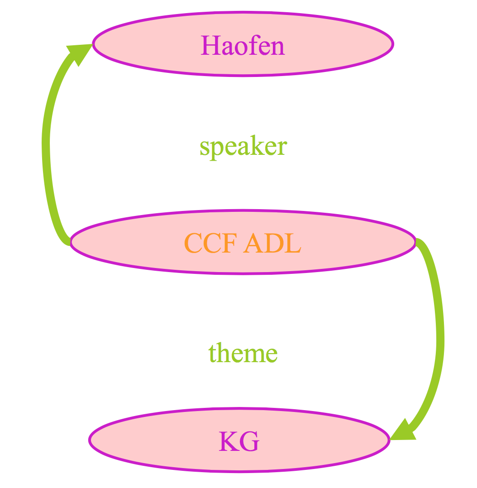
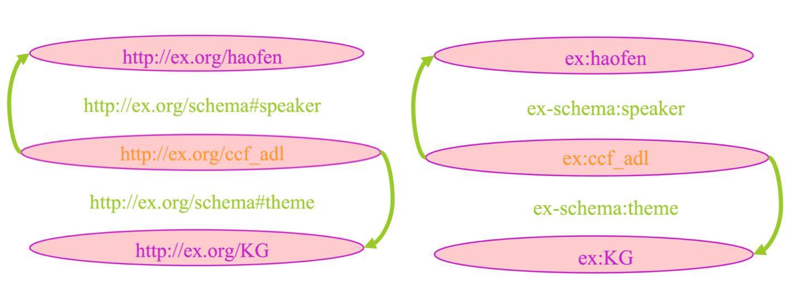
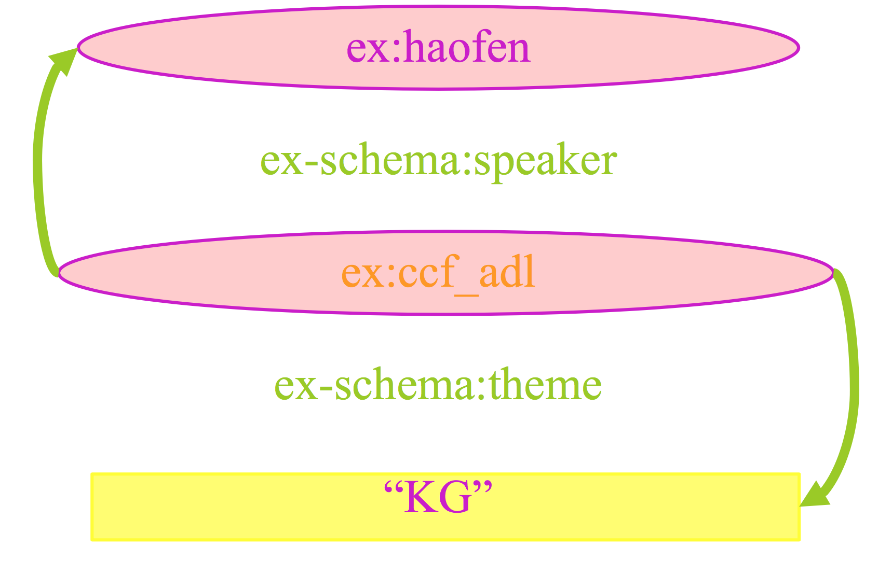
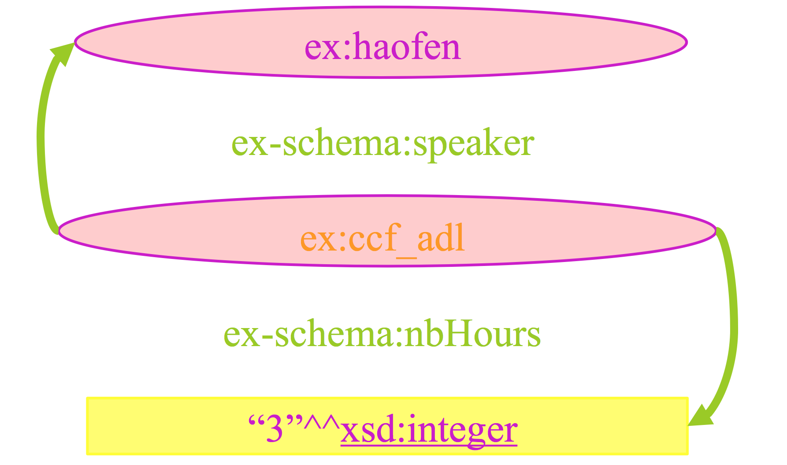
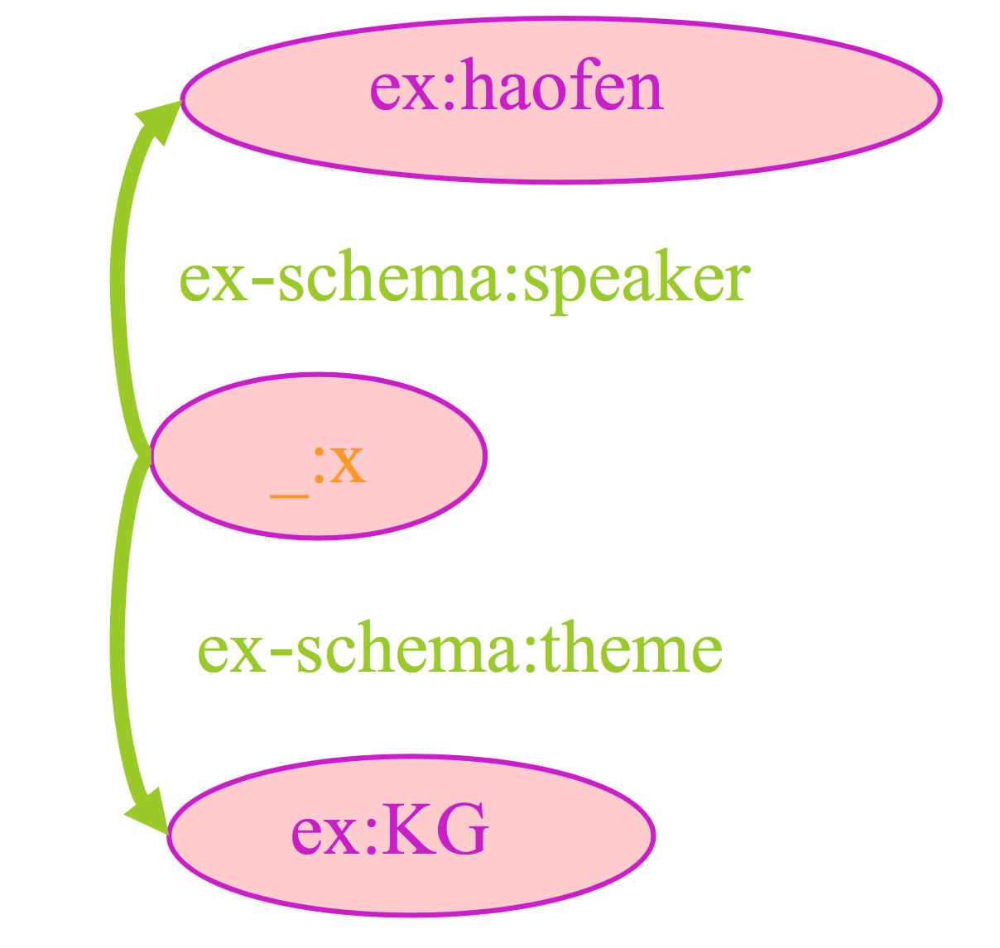

* Chapter 1 - Knowledge Graph Overview

    * From different perspectives to see KG

        * Web: similar to hyperlinks between text, build semantic links between data and support semantic searching

        * NLP: how to extract semantics and structural data from text

        * KR: how to use computational symbols to represent and process knowledge

        * AI: how to use knowledge base to help understand human language

        * DB: store knowledge in graphs

---

* Chapter 2 - Knowledge Representation and modelling
  
    * RDF
        * RDF represents Resource Description Framework
  
        * In RDF, knowledge appear as triple (subject, predicate, object)
          
        * RDF is also a graphical model to link the descriptions of resources
          
            * RDF triples can be seen as arcs of a graph (vertex + edge + vertex)
            
              
              
              CCF ADL invites Haofen as a speaker; The theme of speech is KG;
        
        * In RDF resources and properties are identified by URIs
        
          
          
        * In RDF values of properties can also be literals i.e. strings of characters
        
          
        
          (CCF ADL, Speaker, Haofen)
          
          (CCF ADL, theme, **"KG"**)
        
        * In RDF literal values of properties can also be typed with XML datatypes
        
            * For example, CCF ADL has one speaker Haofen and last 3 hours
            
              
        
        * Blank Nodes are allowed in RDF
        	
            * A resource can be anonymous
        	
        	   * Not labelled by URI, labelled as _: xyz
        	  
        	   * For example, Haofen is the speaker of one (but not interested which one) KG conference
 
 				  
 				
 			      * This is a 2-hop relationship
---
